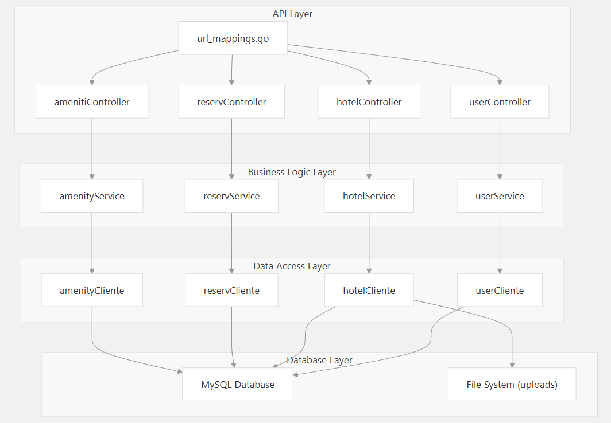

# Sistema de Reservas de Hoteles

Este proyecto es una aplicación web para la gestion de hoteles y reservas. Desarollado para la materia **Arquitectura de Software** en la Universidad Catolica de Cordoba. Permite a usuarios registrarse, buscar, seleccionar hoteles y hacer reservas, así como a administradores gestionar hoteles, habitaciones, imágenes, amenities y más. 


## Arquitectura:
Este proyecto sigue el patrón de diseño **Model-View-Controller (MVC)**, promoviendo una separación clara entre:
- **Modelo:** lógica de negocio, entidades y persistencia de datos.
- **Vista:** interfaz de usuario construida con React.
- **Controlador:** maneja la interacción entre vistas y modelos.
Esto facilita el mantenimiento, pruebas y escalabilidad de la aplicación.


### Tecnologías y Herramientas
```
  - BACKEND:
    - GoLang
    - gin-gonic
    - gorm
- FRONTEND:
    - React
    - CSS
- DB:
  - MySQL
```


### Estructura del Proyecto

```plaintext
├── backend/
│   ├── app/
│   ├── controllers/
│   ├── services/
|   ├── clients-dao/
│   ├── models/
|   ├── db/              
│   ├── dto/
│   └── main.go
├── frontend/
│   ├── client/
│   └── public/
├── db
│   ├──db.sql
├── docker-compose.yml
├── README.md
└── assets
````


## Funcionalidades implementadas
- Registro y login de usuarios.
- Listado y filtro de hoteles.
- Reservas con fechas y cantidad de personas.
- Administración de hoteles, imágenes y amenities.
- Usuario viajante y Usuario adminstrador
- Edición inline de hoteles y reservas.
- Manejo de imágenes.


## Backend Layers:
Se muestra como esta estructura la separacion de funcionalidades logicas en el backend: 
<p align="center">
  
</p>


## Para utilizarlo:
1.  **Clona el repositorio:**
2.  **Levanta los servicios con Docker Compose:**
    
    ```bash
    docker compose up --build -d
    ```
3. **Accede a la aplicación**
    -   **Frontend:** Abre tu navegador y ve a [http://localhost:3000](http://localhost:3000)
    -   **Backend API:** La API estará disponible en `http://localhost:8090`

#### Detener la Aplicación

Para detener todos los servicios:
```bash
docker compose down
```
---
<br>


El proyecto fue realizado con fines educativos, y busca poner en práctica conceptos fundamentales de arquitectura de software, separación de capas, y diseño limpio en sistemas web modernos.

👨‍💻 Autor:
Tomás Ossana
- Estudiante de Ingeniería en Computación
- Universidad Católica de Córdoba
